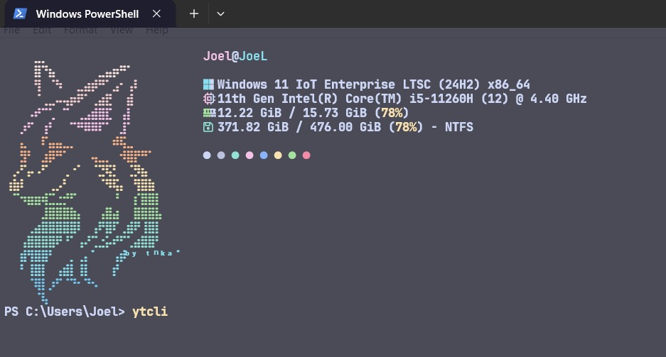
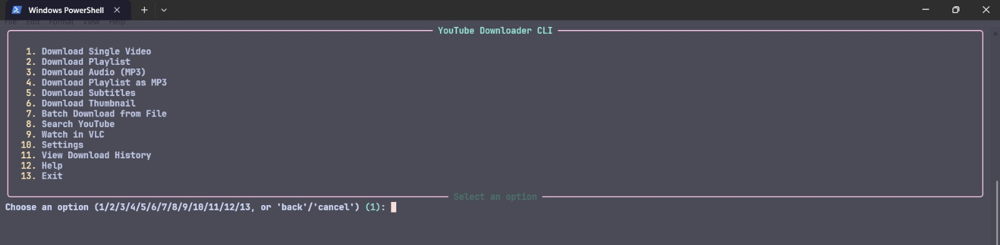
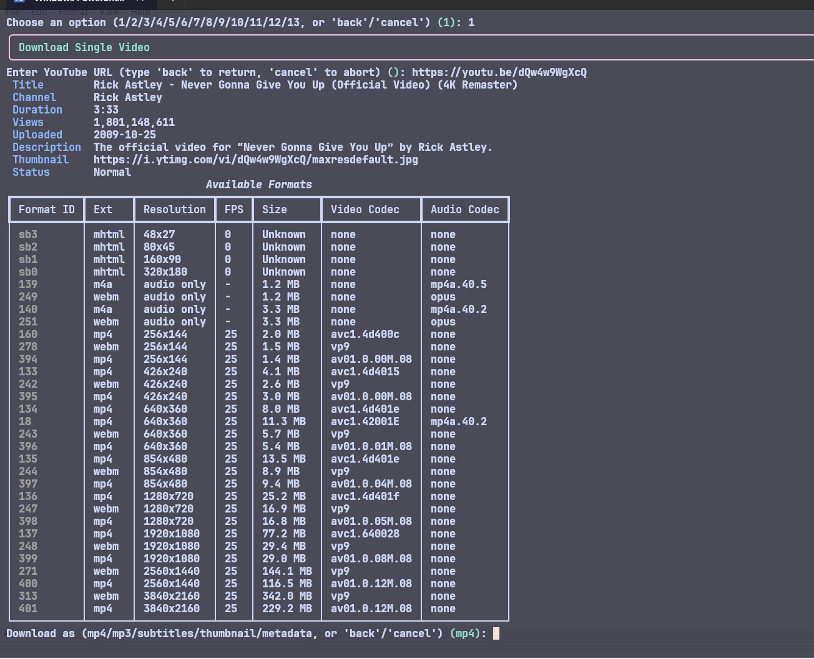
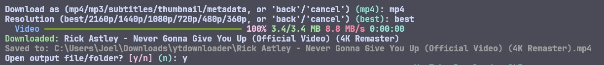
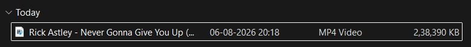

# YouTube Downloader CLI

A terminal-based YouTube downloader and streamer, built with Python and [yt-dlp](https://github.com/yt-dlp/yt-dlp). It gives you a clean, interactive menu for downloading videos, playlists, audio, subtitles, and thumbnails, streaming videos straight into VLC without downloading them, and a scriptable command-line interface for automation.

## Table of Contents

- [What This Is](#what-this-is)
- [Why It Exists](#why-it-exists)
- [How It Works](#how-it-works)
- [Requirements](#requirements)
- [Installation](#installation)
- [Usage Walkthrough](#usage-walkthrough)
- [Uninstallation](#uninstallation)
- [Configuration](#configuration)
- [CLI Command Reference](#cli-command-reference)
- [Troubleshooting](#troubleshooting)
- [Disclaimer and Legal Notice](#disclaimer-and-legal-notice)
- [Roadmap](#roadmap)
- [Contributing](#contributing)
- [Credits](#credits)
- [License](#license)

## What This Is

A single command-line tool, `ytdownloader` (or `ytcli`), that you install once and run from any folder on your computer. It wraps `yt-dlp` — the engine that does the actual downloading — behind a polished terminal menu, so you never need to memorize command-line flags or read `yt-dlp` documentation to use it.

From the menu you can:

- Download a single video (with a details preview before you commit: title, channel, duration, views, formats, file size)
- Download an entire playlist, with filtering (skip Shorts, filter by duration, keywords, upload date, and more)
- Extract audio as MP3 at your chosen bitrate
- Download subtitles or thumbnails on their own
- Batch-download a list of URLs from a text file, CSV, or JSON file
- Search YouTube directly from the terminal
- Stream a video straight into VLC without downloading anything
- Review and manage a persistent download history

## Why It Exists

`yt-dlp` is powerful but its command-line interface is dense: dozens of flags, format selectors, and options that assume familiarity with the tool. This project hides that complexity behind plain-English menus and prompts, while still giving you access to the advanced features (filters, rate limiting, cookies, proxies) when you want them, through a proper Settings menu instead of remembering flags.

## How It Works

1. You run `ytdownloader` from any terminal.
2. A menu appears; you pick a number for what you want to do.
3. The tool asks you a few plain-English questions (resolution? bitrate? which playlist range?).
4. It hands those choices to `yt-dlp` internally, which does the actual downloading, using FFmpeg to merge video/audio or extract audio when needed.
5. Results are saved to your chosen output folder and recorded in a local history file.

Nothing is downloaded without you confirming it, and every failure (private video, no internet, missing FFmpeg, low disk space) is caught and explained instead of crashing the app.

## Requirements

- **Python 3.11 or later**
- **FFmpeg** on your system `PATH` — required for merging video/audio, extracting MP3, and embedding thumbnails/subtitles
- **VLC** on your system `PATH` (or installed to its default location) — required only for the "Watch in VLC" streaming feature
- Works on **Windows, Linux, and macOS**

### Installing FFmpeg

| Platform | Command |
| - | - |
| Windows | `winget install Gyan.FFmpeg` |
| macOS | `brew install ffmpeg` |
| Linux (Debian/Ubuntu) | `sudo apt install ffmpeg` |

Confirm it worked: `ffmpeg -version`

### Installing VLC

| Platform | Command |
| - | - |
| Windows | `winget install VideoLAN.VLC` |
| macOS | `brew install --cask vlc` |
| Linux (Debian/Ubuntu) | `sudo apt install vlc` |

VLC is optional. If it's missing, everything except "Watch in VLC" still works normally.

## Installation

### Option 1: One-click installer (recommended)

This sets up a virtual environment, installs all dependencies, and adds `ytdownloader`/`ytcli` to your PATH so you can run them from any folder afterward.

**Step 1 — Clone the repository:**

```bash
git clone https://github.com/JoelDlima/yt-cli.git
cd yt-cli
```

**Step 2 — Run the installer for your platform:**

Windows (double-click `install.bat`, or run from a terminal):

```bat
install.bat
```

Linux/macOS:

```bash
chmod +x install.sh
./install.sh
```

**Step 3 — Open a new terminal window** (PATH changes only apply to new terminal sessions) and run:

```bash
ytdownloader
```

You can run this from any folder — you do not need to `cd` into the cloned repository again.

The installer works from whatever folder you clone the repository into, on any Windows, Linux, or macOS machine. It does not depend on any specific username, drive letter, or folder location — it resolves everything relative to its own location. You can install it on as many of your own machines as you like by repeating these steps on each one. Re-running the installer at any time (e.g. after `git pull`) is safe.

### Option 2: Manual installation

If you'd rather manage the virtual environment yourself:

```bash
git clone https://github.com/JoelDlima/yt-cli.git
cd yt-cli
python -m venv .venv
```

Activate it:

```bash
# Windows
.venv\Scripts\activate

# Linux/macOS
source .venv/bin/activate
```

Install:

```bash
pip install -e .
```

With this option, you must activate the virtual environment in every new terminal session before running `ytdownloader`.

Optional extras:

```bash
pip install -e ".[extra]"   # clipboard URL detection, disk space checks
pip install -e ".[dev]"     # test suite dependencies
```

Verify: `ytdownloader --version`

## Usage Walkthrough

Launch the app from any terminal, using either `ytdownloader` or its shorter alias `ytcli` — both commands run the exact same tool, installed together, so use whichever you prefer:

```bash
ytdownloader
# or
ytcli
```

**Step 1 — Launch it from any terminal.**



You'll land on the main menu. Type a number and press Enter to select an option. At any prompt, type `back` to go back a step, `cancel` to abort, or `help` for guidance. `Ctrl+C` interrupts safely at any point.

**Step 2 — Choose an option from the main menu.**



**Step 3 — Enter a URL, or search for a video by name.** If you search, you'll get a results table to pick from.



**Step 4 — Choose your download options** (format, resolution/bitrate, subtitles, and so on).



**Step 5 — The download completes and is saved to your chosen output folder,** recorded automatically in your download history.



The same menu structure and prompts apply to playlists, audio extraction, subtitles, thumbnails, batch downloads, and streaming to VLC — pick the relevant main menu number and follow the prompts.

### Non-interactive mode (scripting)

Every core action is also available as a direct command, useful for automation or quick one-off runs without going through the menu. Both `ytdownloader` and `ytcli` accept the same commands and flags:

```bash
# Download a single video at 1080p
ytdownloader download "https://youtu.be/VIDEO_ID" --resolution 1080p

# Extract audio as MP3 at 192 kbps
ytdownloader download "https://youtu.be/VIDEO_ID" --audio-only --bitrate 192

# Preview video details only, without downloading
ytdownloader download "https://youtu.be/VIDEO_ID" --dry-run

# Download every URL listed in a text/CSV/JSON file
ytdownloader batch urls.txt --resolution 720p

# Read URLs from standard input
cat urls.txt | ytdownloader batch -

# Search YouTube and print a results table
ytdownloader search "python tutorial" --max-results 5

# Stream a video directly to VLC, no download
ytdownloader watch "https://youtu.be/VIDEO_ID"

# Or play the top result for a search query
ytdownloader watch "big buck bunny 4k" --resolution 720p

# View or export download history
ytdownloader history
ytdownloader history --export history.csv
```

Run `ytdownloader --help` or `ytdownloader <command> --help` for the full list of options for each command.

## Uninstallation

Run the uninstaller for your platform from the cloned repository folder:

```bat
uninstall.bat
```

```bash
chmod +x uninstall.sh
./uninstall.sh
```

This removes the `.venv` virtual environment and the PATH entry that pointed to it. You'll be asked separately whether to also delete persistent application data (settings, history, logs, download archive) stored at `~/.ytdownloader` — keep it if you plan to reinstall later.

The uninstaller does not delete the cloned repository folder itself; remove that manually if you no longer need the source code.

## Configuration

Settings and history are stored in your home directory, not inside the repository:

| File | Purpose |
| - | - |
| `~/.ytdownloader/config.json` | Persistent settings |
| `~/.ytdownloader/history.json` | Download history |
| `~/.ytdownloader/download_archive.txt` | Duplicate download prevention |
| `~/.ytdownloader/logs/ytdownloader.log` | Rotating debug/error logs |

Edit settings interactively from the main menu ("Settings"), or edit `config.json` directly. Fields include output directory, default video/audio quality, concurrency, retry attempts, theme, overwrite/skip behavior, filename templates, cookie file, proxy, rate limiting, sleep intervals, and subtitle language preferences.

### Filename templates

Uses `yt-dlp`-style output templates:

- `%(title)s.%(ext)s` → `My Video.mp4`
- `%(playlist_index)02d - %(title)s.%(ext)s` → `01 - Variables.mp4`

Invalid filesystem characters are sanitized automatically, and filename collisions are resolved by appending `(1)`, `(2)`, and so on.

## CLI Command Reference

| Command | Description |
| - | - |
| `ytdownloader` | Launch the interactive menu |
| `ytdownloader download <url>` | Download a single video or its audio, non-interactively |
| `ytdownloader batch <file\|->` | Batch download from a file or standard input |
| `ytdownloader search <query>` | Search YouTube and print a results table |
| `ytdownloader watch <url\|query>` | Stream a video directly to VLC without downloading it |
| `ytdownloader history` | View or export download history |
| `ytdownloader --version` | Print the installed version |

## Troubleshooting

- **FFmpeg is required but was not found**: install FFmpeg and confirm `ffmpeg -version` works in your terminal.
- **VLC is required but was not found**: install VLC and ensure it's on `PATH`, or (Windows) installed to the default `Program Files\VideoLAN\VLC` location. Only affects "Watch in VLC".
- **Video is private, age-restricted, or deleted**: reported directly by the app. Age-restricted content may need a cookie file configured in Settings.
- **Rate limited / HTTP 429 errors**: lower `concurrent_downloads`, increase `sleep_interval`, or wait before retrying.
- **Downloads are skipped unexpectedly**: check the `skip_existing` setting and the archive file at `~/.ytdownloader/download_archive.txt`. Duplicates are skipped by design; this lets you safely resume an interrupted playlist download by re-running it.
- **Low disk space warning**: the app checks free space before large downloads and asks for confirmation if space is low.
- **Command not found after installing**: open a brand new terminal window — PATH changes from the installer only apply to sessions opened after it ran.

## Disclaimer and Legal Notice

This tool is provided "as is", for personal, lawful use. Please read this section before using it.

- **You are responsible for what you download.** Only download or stream content you own, have explicit permission for, or that is licensed to allow it (e.g. Creative Commons, public domain). Downloading copyrighted content without the rights holder's permission may violate copyright law in your country and YouTube's Terms of Service.
- **This project is not affiliated with, endorsed by, or sponsored by YouTube, Google, VideoLAN/VLC, or the yt-dlp project.** It is an independent tool that uses the open-source `yt-dlp` library.
- **The maintainers of this repository accept no liability** for how this software is used, for any legal consequences arising from its use, or for any damage, data loss, or other harm resulting from running it on your system. Use it at your own risk.
- **This tool does not collect, transmit, or share any of your data.** All settings, history, and downloaded files stay on your local machine, in your own home directory. Nothing is sent to any third party by this software itself.
- **No warranty is provided.** The software is distributed under the MIT License (see below), which explicitly disclaims all warranties, express or implied.
- If you run this on a machine or network you do not own or administer (e.g. a work computer, a shared/public machine), get permission first — installing software and running network requests may be against local policy.

In short: this is a personal productivity tool for content you already have the right to access. Respect content creators, respect platform terms of service, and use good judgment.

## Roadmap

- Queue management with pause/resume across sessions
- Scheduled and recurring downloads
- Plugin system for custom filters and post-processing hooks
- Shell autocomplete packaging
- Webhook notifications on batch completion

## Contributing

Issues and pull requests are welcome. Run `pytest -q` before submitting changes, and keep new code type-hinted and documented in line with the existing modules.

## Credits

Built on [yt-dlp](https://github.com/yt-dlp/yt-dlp), [Rich](https://github.com/Textualize/rich), [Typer](https://typer.tiangolo.com/), and [Pydantic](https://docs.pydantic.dev/).

## License

MIT. See [LICENSE](LICENSE).
